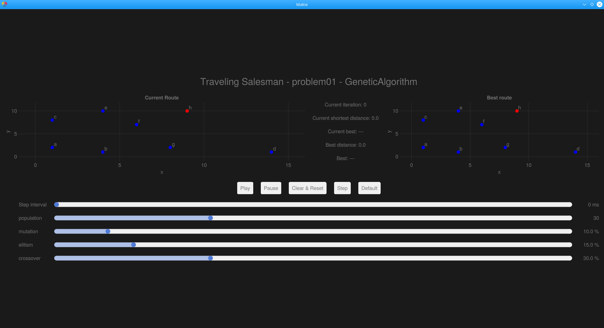
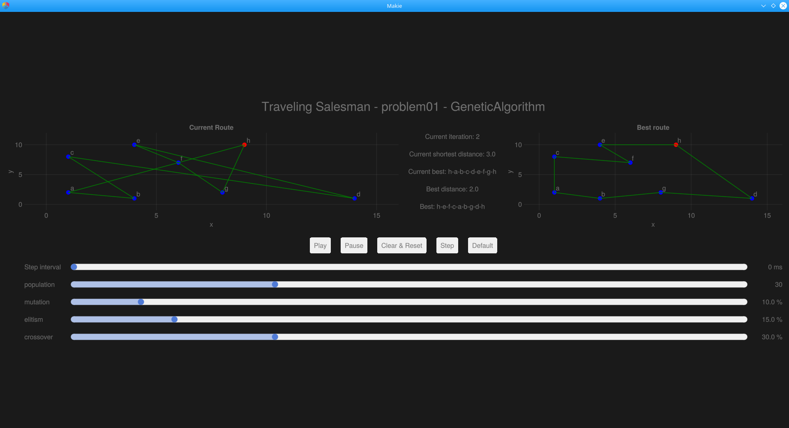

<div id="top"></div>


<!-- PROJECT LOGO -->
<br />
<div align="center">
    <h3 align="center">Traveling Salesman GUI</h3>
    <p align="center">
        Julia project showcasing algorithms capable of solving TSP.
    </p>
</div>


<!-- TABLE OF CONTENTS -->
<details>
    <summary>Table of Contents</summary>
    <ol>
        <li>
            <a href="#about-the-project">About The Project</a>
        </li>
        <li>
            <a href="#getting-started">Getting Started</a>
            <ul>
                <li><a href="#Libraries">Libraries</a></li>
                <li><a href="#installation">Installation</a></li>
            </ul>
        </li>
        <li>
            <a href="#usafe">Usage</a>
            <ul>
                <li><a href="#description">Description</a></li>
                <li><a href="#Algorithms">Algorithms</a></li>
            </ul>
        </li>
    </ol>
</details>


<!-- ABOUT THE PROJECT -->
## About The Project

Project solving the [TSP](https://en.wikipedia.org/wiki/Travelling_salesman_problem) problem using iterative algorithms to achieve good solution (non-optimal) in reasonable amount of time.

This project contains GUI for the [TravelingSalesman](https://github.com/Matyxus/julia) project.

<p align="right">(<a href="#top">back to top</a>)</p>

<!-- GETTING STARTED -->
## Getting Started

### Libraries

* [GLMakie](https://docs.makie.org/stable/)

### Installation

Use [Pkg](https://docs.julialang.org/en/v1/stdlib/Pkg/) to install project from GitHub.
```julia
(env) pkg> add https://github.com/Urlikp/TravelingSalesmanGUI
```

<p align="right">(<a href="#top">back to top</a>)</p>

<!-- USAGE EXAMPLES -->
## Usage
This project is expected to be used with the [TravelingSalesman](https://github.com/Matyxus/julia) project, but basic functionality can be tested as can be seen in [Main.jl](./examples/Main.jl)

Basic usage:
```julia
using TravelingSalesmanGUI
.
.
.
gui = GUI(params)
```
Where *params* is a dictionary containing parsed JSON file located inside [data](./data) folder, which provides all the input related variables.


### Description
Files containing input of program are of type ".json", each algorithm has its own parameters e.g. GeneticAlgorithm has elitism, population, etc. In file there is also "seed" provided to keep the results always the same (for given seed).

Here are some screenshots showing the testing of GUI as can be seen in [Main.jl](./examples/Main.jl)





### Algorithms
There are 2 algorithms provided to solve the TSP:
1. [GeneticAlgorithm](./src/GeneticAlgorithm.jl)\
inspired by: https://en.wikipedia.org/wiki/Genetic_algorithm \
https://www.youtube.com/watch?v=hnxn6DtLYcY, \
https://www.youtube.com/watch?v=XP8R0yzAbdo \
crossover implemented by: https://user.ceng.metu.edu.tr/~ucoluk/research/publications/tspnew.pdf

3. [SimulatedAnnealing](./src/SimulatedAnnealing.jl) - https://en.wikipedia.org/wiki/Simulated_annealing


<p align="right">(<a href="#top">back to top</a>)</p>